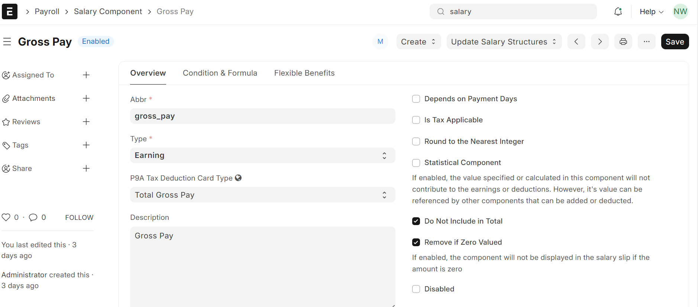
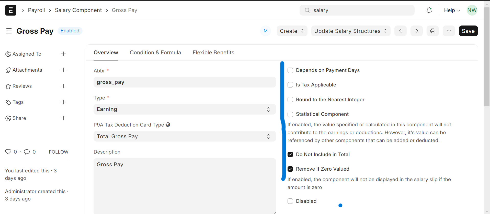
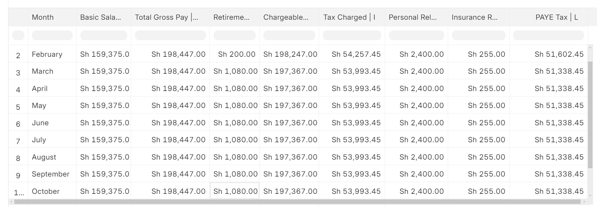

## P9A Tax Deduction Card Setup

### Salary Component Mapping for P9A

This guide explains the process of mapping salary components to the P9A Tax Deduction Card Type in a Frappe-based system. Follow these steps to configure and manage the salary components effectively.

### Step-by-Step Process

#### Access the Frappe Application

1. **Log into your Frappe instance with your credentials.**

#### Navigate to Salary Component DocType

2. **Go to the DocType list and search for "Salary Component".**
3. **Click on "Salary Component" to view and manage the components.**
  

#### Create New Salary Components

4. **Create a new salary component in the Frappe system.**
5. **Click on "Add Salary Component " to add a new component.**
  

   
#### Fill in the Salary Component Details

6. **Component Name**: Fill in the component name.
7. **Type**: Choose whether its an earning or deduction (based on your payroll structure).
8. **P9A Tax Deduction Card Type**: Set this field using the value from the "P9A Tax Deduction Card Type" column.
   

#### Configure Additional Fields

9. Set other fields like "Do Not Include in Total", "Exempted from Income Tax", "Is Income Tax Component", etc., based on your organizational requirements and the data provided.
   

#### Save the Component

10. Once all relevant fields are filled, **save the new salary component**.
11. Repeat the process for each component.

#### Verify the Components

12. After all components are created, verify that they are correctly mapped and appear as expected in the payroll process.
13. Test the payroll calculations to ensure the formulas are working correctly and the tax deductions are being applied as per the P9A card types.
    

### Notes

- Ensure that the formulas are correctly adapted to your Frappe system’s syntax.
- Double-check the P9A tax deduction card types to ensure compliance with your local tax regulations.
- Update the system documentation to reflect any changes made during this process.