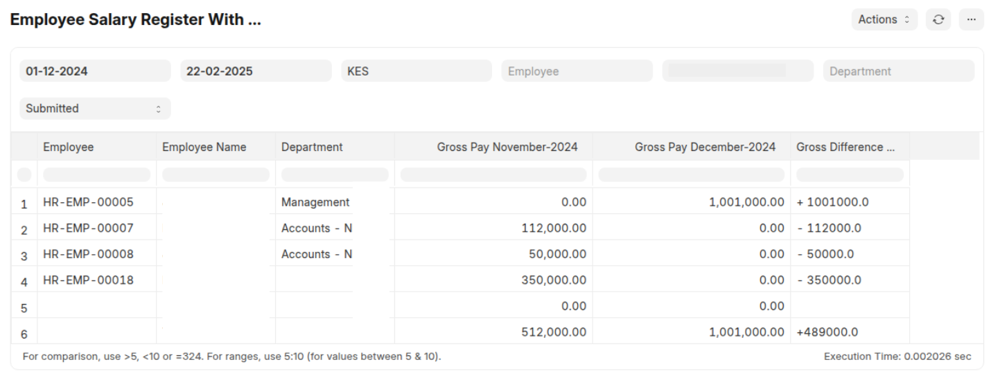

# Employee Gross Pay Comparison Report

This report compares the gross pay of employees between the current month and the previous month.

## Purpose

This report is designed to provide a quick overview of changes in employee gross pay between two consecutive months. It helps identify employees with significant pay variations and provides a summary of overall gross pay changes.

## Features

* **Employee-Level Comparison:** Displays gross pay for each employee for both the current and previous months.
* **Gross Pay Difference:** Calculates and shows the difference in gross pay between the two months.
* **Departmental Context:** Includes the employee's department for better context.
* **Total Gross Pay Summary:** Provides a total gross pay for each month and the overall difference.
* **Clear Difference Indicator:** Uses "+" and "-" signs to visually indicate increases and decreases in gross pay.
* **Filtering:** Allows filtering by company, date range, department, employee, currency, and document status.
* **Error Handling:** Provides user friendly messages when data is missing.

## How to Use

1.  **Filtering:**
    * **Company:** Select the company for which you want to generate the report.
    * **From Date:** Select the start date of the current month. The report will automatically calculate the previous month.
    * **To Date:** Select the end date of the current month.
    * **Department (Optional):** Filter the report by a specific department.
    * **Employee (Optional):** Filter the report by a specific employee.
    * **Currency (Optional):** Filter the report by a specific currency. If no currency is selected, the company's default currency will be used.
    * **Docstatus (Optional):** Filter the report by the salary slip document status.
2.  **Report Output:** The report will display the following columns:
    * **Employee:** The employee ID.
    * **Employee Name:** The employee's name.
    * **Department:** The employee's department.
    * **Gross Pay (Previous Month):** The gross pay for the employee in the previous month.
    * **Gross Pay (Current Month):** The gross pay for the employee in the current month.
    * **Gross Difference Amount:** The difference between the current month and previous month gross pay. Positive values are indicated with a "+", negative with a "-", and zero with "0".
4.  **Totals:** The report includes a total row showing the total gross pay for both months and the overall difference.

## Important Notes

* The report relies on existing salary slip data in ERPNext. Ensure that salary slips are created for both the current and previous months.
* If no salary slips are found for either month, the report will display an appropriate message.
* The report only compares gross pay. For detailed salary component analysis, use the "Salary Comparison Report".
* Make sure that the filters are chosen correctly.
