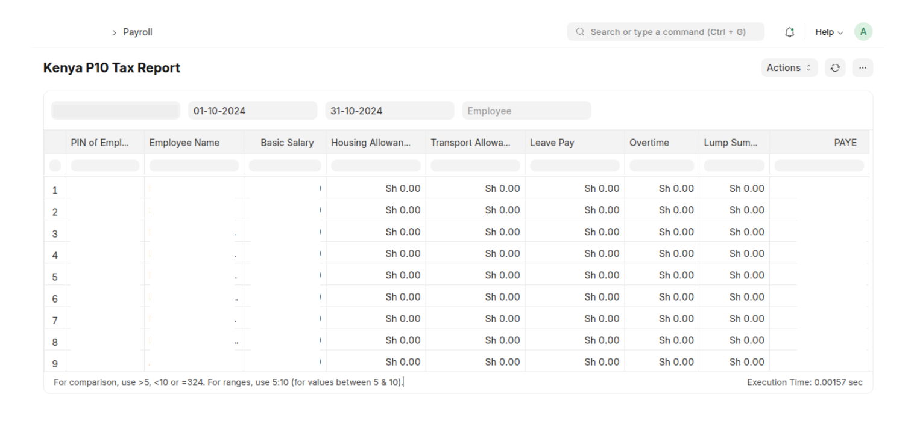

# P10 Payroll Tax Report

## Overview

The P10 Payroll Tax Report is a report that generates structured payroll tax data for employees. It extracts key salary components (Basic Salary, Allowances, Overtime, PAYE, etc.) from employee salary slips within a specified date range and presents them in a structured format. This report helps in tracking payroll taxes and ensuring compliance with tax regulations.

## Features

**Comprehensive Data:** Captures all necessary information for the P9A form, including:
- ✅   PIN of Employee
- ✅   Employee Name
- ✅   Basic Salary
- ✅   Housing Allowance
- ✅   Transport Allowance
- ✅   Leave Pay
- ✅   Overtime
- ✅   Lump Sum Payment
- ✅   PAYE

**Company Filtering:** Generate reports for specific companies
**Data Range Filtering:**
**Employee Filtering:**
**Aggregation of data:** Data is aggregated per employee.

## How to Use

1. **Accessing the Report:** "Kenya Workspace" -> "P10A Tax Report" or search for "P10A TAX Report" on the "Awesome Seachbar"

2.  **Filtering:**
    *   Company (required)
    *   Date Range (required) i.e., From Date - To Date
    *   Employee (optional)

3.  **Viewing the Report:** The report will be displayed in a tabular format, showing the employee breakdown of earnings and deductions.

