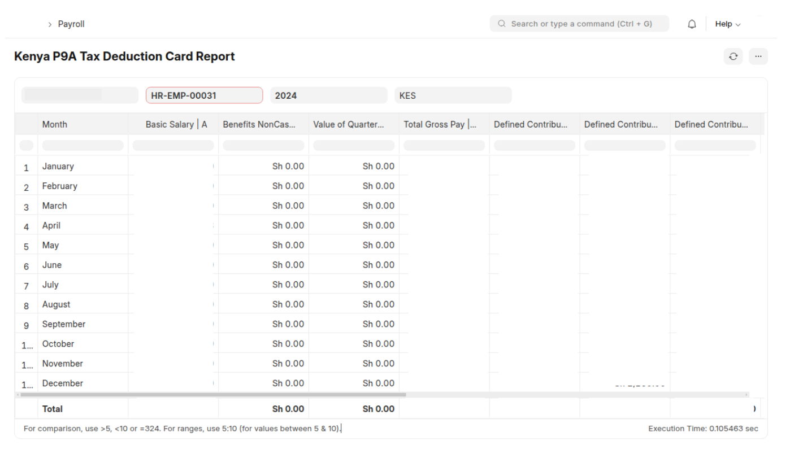

# P9A Tax Deduction Card Report

## Overview

The P9A Tax Deduction is a mandatory tax report for employees in Kenya. It retrieves salary components, calculates retirement contributions, determines taxable income, and outputs a structured table for each employee across a fiscal year.

## Features

**Comprehensive Data:** Captures all necessary information for the P9A form, including:
- ✅   Basic Salary
- ✅   Benefits (Cash and Non-Cash)
- ✅   Value of Quarters
- ✅   Total Gross Pay
- ✅   Defined Contribution Retirement Scheme contributions (E1, E2, E3)
- ✅   Owner Occupied Interest
- ✅   Retirement Contribution and Owner Occupied Interest
- ✅   Chargeable Pay
- ✅   Tax Charged
- ✅   Personal Relief
- ✅   Insurance Relief
- ✅   PAYE Tax
**Fiscal Year Filtering:**  Generate reports for specific fiscal years.
**Company Filtering:** Generate reports for specific companies.
**Currency Handling:** Supports different currencies and handles currency conversions appropriately.  The report respects the company's base currency and allows for reporting in a specified currency, converting amounts as needed.
**Monthly Breakdown:** Provides a detailed breakdown of earnings and deductions for each month of the fiscal year.
**ERPNext Integration:** Seamlessly integrates with ERPNext's payroll module, retrieving data directly from Salary Slips and Salary Components.

## How to Use

1.  **Accessing the Report:** Once installed, you can access the report through the ERPNext user interface. Go to "Kenya Workspace" -> "P9A Tax Deduction Card Report" or on the "Awesome Searchbar"

2.  **Filtering:**
    *   Fiscal Year (required)
    *   Company (required)
    *   Employee (required)
    *   Currency ("KES")

3.  **Viewing the Report:** The report will be displayed in a tabular format, showing the monthly breakdown of earnings and deductions for the selected employee and fiscal year.

