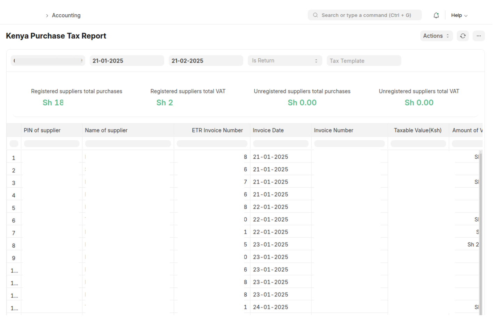
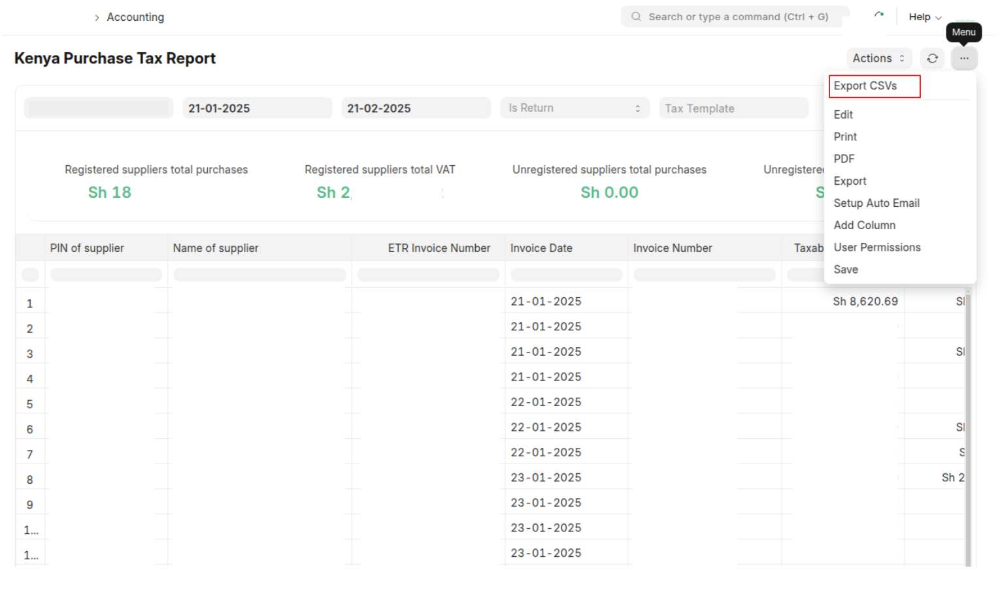
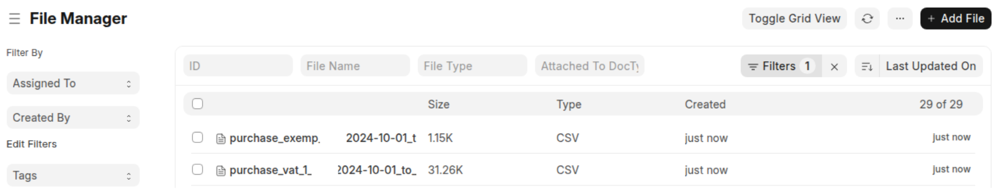

# Kenya Purchase Tax Report  

**Kenyan purchase tax tracking**, is designed to generate **VAT-compliant summaries** with supplier details, taxable amounts, and invoice returns. It includes an automated **CSV export** for easy tax reporting.  

## Features  

- **Filters by Date & Company** – Fetches **approved** purchase invoices within a specified period.  
- **Tax Categorization** – Groups invoices under item tax templates e.g., **VAT 16%, Exempt, and Zero-Rated**.  
- **Detailed Tax Breakdown** – Computes **taxable value and VAT amounts** per supplier.  
- **Handles Returns** – Links return invoices to their original purchases.  
- **Automated CSV Export** – Generates structured CSV files for **KRA tax submissions**.  

## How to Use  

1.  **Accessing the Report:** Once installed, you can access the report through the ERPNext user interface. Go to "Kenya Workspace" -> "Kenya Purchase Tax Report" or on the "Awesome Searchbar"
2.  **Filtering:**
    *   Company (required)
    *   Date Range (required) i.e., From Date - To Date
    *   Is Return (optional)
    *   Tax Template (optional)

3. View the **detailed tax summary** grouped by tax categories.  
4. Click **Export CSVs** to generate a tax-compliant CSV file. 

5. Download and Upload the **CSV files**.  

## Configuration  

- Ensure your item tax templates for the general, exempt and zero-rated tax templates contain the words "VAT 16%", "Exempt", "Zero Rated". 

## Troubleshooting  

- **Report shows no data?** Ensure purchase invoices exist for the selected **company & date range**.  
