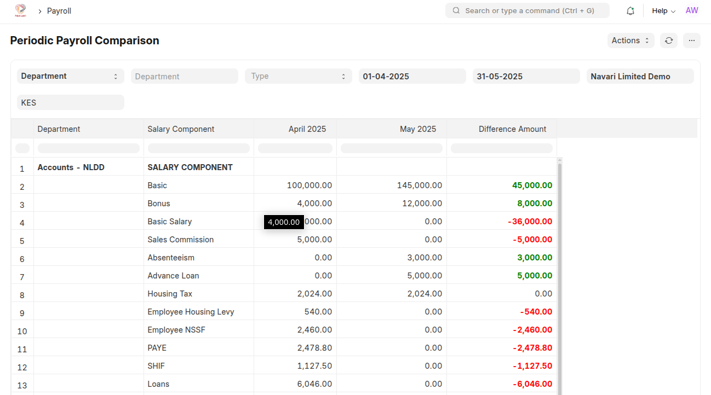
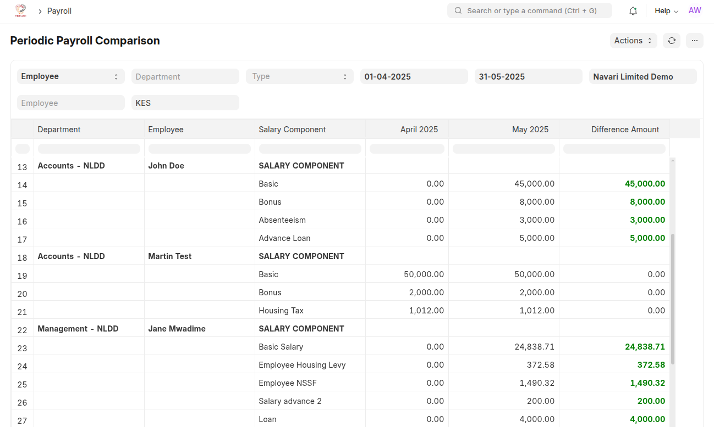
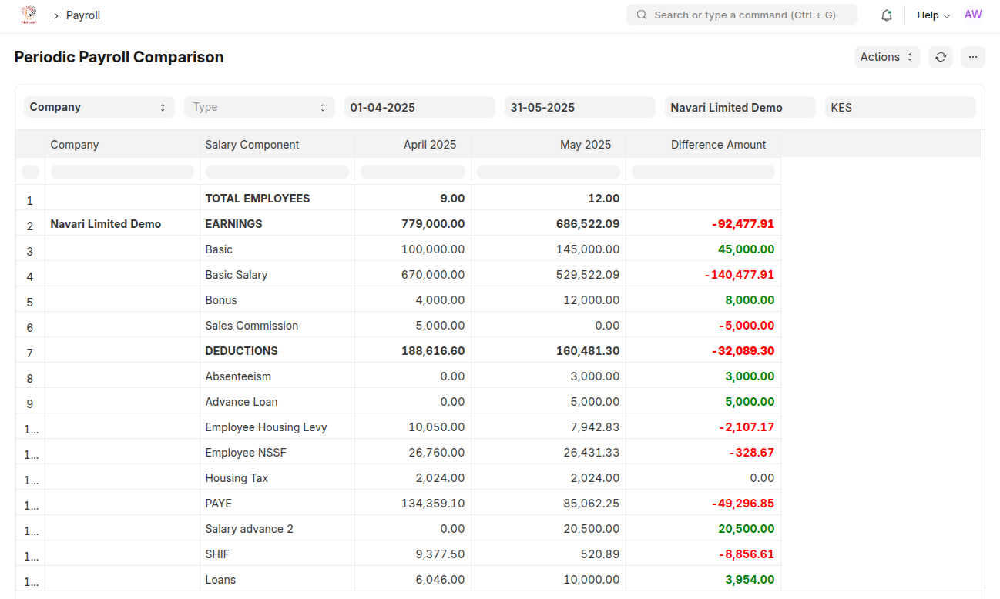

# Periodic Payroll Comparison

This report compares salary slips between the current month and the previous month, providing a detailed breakdown of changes in salary components (Earnings, Deductions) and Loan repayments.

## Purpose

This report is designed to help HR and finance departments analyze salary changes between two consecutive months. It provides insights into:

- Fluctuations in salary components (Earnings, Deductions).
- Fluctuation in Loan Repayments.
- Changes in the number of employees.

## Features

- **Side-by-Side Comparison:** Compares salary components between the current and previous months.
- **Detailed Breakdown:** Shows changes in earnings, deductions as well as loan repayments.
- **Employee Count:** Includes the difference in the number of employees.
- **Department/Employee Filtering:** Granular analysis by department or individual.
- **Currency Handling:** Handles both company default and custom report currencies.
- **Clear Output:** Formats the data for easy readability in a report format.
- **Visual Indicators:** Color-coded differences (green=increase, red=decrease).
- **Error Handling:** Provides user-friendly messages when data is missing.

## Usage Guide

1.  **Accessing the Report:** Once installed, you can access the report through the ERPNext user interface. Go to "Kenya Workspace" -> "Periodic Payroll Comparison" or on the "Awesome Searchbar"

1.  **Filtering:**
    - **Company:** Select the company for which you want to generate the report.
    - **From Date:** Select the start date of the current month. The report will automatically calculate the current month - 2.
    - **To Date:** Select the end date of the current month - 1.
    - **Department (Optional):** Filter the report by a specific department.
    - **Employee (Optional):** Filter the report by a specific employee.
    - **Currency (Optional):** Filter the report by a specific currency. If no currency is selected, the company's default currency will be used.
1.  **Report Output:** The report will display the following columns:
    - **Department:** The department associated with the salary component.
    - **Salary Component:** The name of the salary component.
    - **Previous Month (Month Year):** The total amount for the salary component in the previous month.
    - **Current Month (Month Year):** The total amount for the salary component in the current month.
    - **Difference Amount:** The difference between the current month and previous month amounts. Positive values are indicated in a green color, negative in a red color, and zero in a black color.
1.  **Totals:** The report includes totals for each salary component category (Earning, Deductions) either per department, per employee or per company. It also shows the total number of employees for each month and the difference between them.

## Important Notes

- The report relies on existing salary slip data in ERPNext. Ensure that salary slips are created for both the current and previous months.
- The report will display the difference of the amount between the two months.
- Make sure that the filters are chosen correctly.
