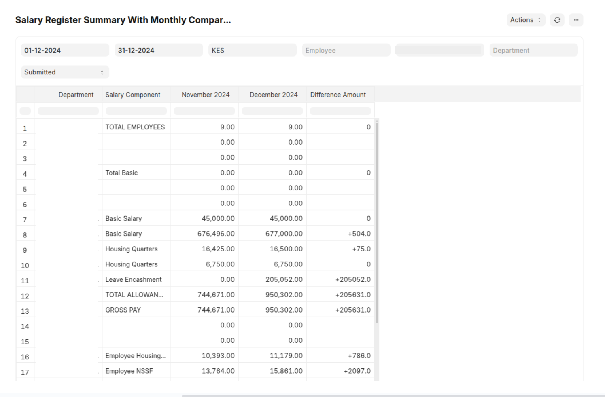

# Salary Comparison Report

This report compares salary slips between the current month and the previous month, providing a detailed breakdown of changes in salary components (Basic, Allowances, Deductions) and the overall net pay.

## Purpose

This report is designed to help HR and finance departments analyze salary changes between two consecutive months. It provides insights into:

* Fluctuations in salary components (Basic, Allowances, Deductions).
* Changes in the number of employees.
* Variations in gross pay and net pay.

## Features

* **Side-by-Side Comparison:** Compares salary components between the current and previous months.
* **Detailed Breakdown:** Shows changes in basic pay, allowances, and deductions.
* **Employee Count:** Includes the difference in the number of employees.
* **Gross and Net Pay Comparison:** Calculates and displays the differences in gross and net pay.
* **Department Filtering:** Allows filtering by department.
* **Currency Handling:** Handles company and report currencies.
* **Clear Output:** Formats the data for easy readability in a report format.
* **Error Handling:** Provides user-friendly messages when data is missing.

## How to Use

1.  **Accessing the Report:** Once installed, you can access the report through the ERPNext user interface. Go to "Kenya Workspace" -> "Kenya Purchase Tax Report" or on the "Awesome Searchbar"

1.  **Filtering:**
    * **Company:** Select the company for which you want to generate the report.
    * **From Date:** Select the start date of the current month. The report will automatically calculate the previous month.
    * **To Date:** Select the end date of the current month.
    * **Department (Optional):** Filter the report by a specific department.
    * **Employee (Optional):** Filter the report by a specific employee.
    * **Currency (Optional):** Filter the report by a specific currency. If no currency is selected, the company's default currency will be used.
    * **Docstatus (Optional):** Filter the report by the salary slip document status.
3.  **Report Output:** The report will display the following columns:
    * **Department:** The department associated with the salary component.
    * **Salary Component:** The name of the salary component (e.g., Basic, Allowances, Deductions).
    * **Previous Month (Month Year):** The total amount for the salary component in the previous month.
    * **Current Month (Month Year):** The total amount for the salary component in the current month.
    * **Difference Amount:** The difference between the current month and previous month amounts. Positive values are indicated with a "+", negative with a "-", and zero with "0".
4.  **Totals:** The report includes totals for each salary component category (Basic, Allowances, Deductions), gross pay, and net pay. It also shows the total number of employees for each month and the difference between them.

## Important Notes

* The report relies on existing salary slip data in ERPNext. Ensure that salary slips are created for both the current and previous months.
* If no salary slips are found for either month, the report will display a "No Salary Found" message.
* The report will display the difference of the amount between the two months.
* The report will show the differences of the number of employees between the two months.
* Make sure that the filters are chosen correctly.
