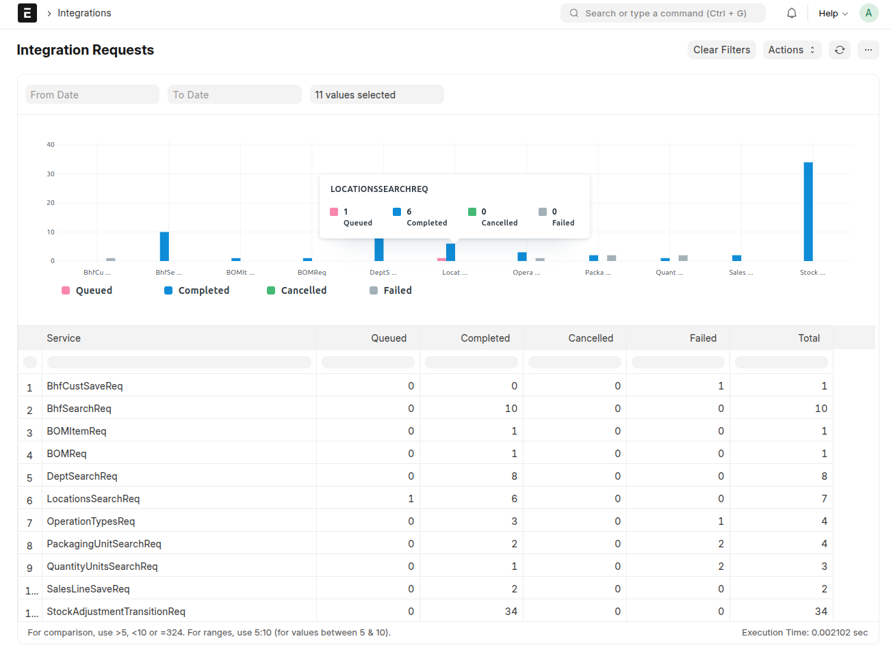
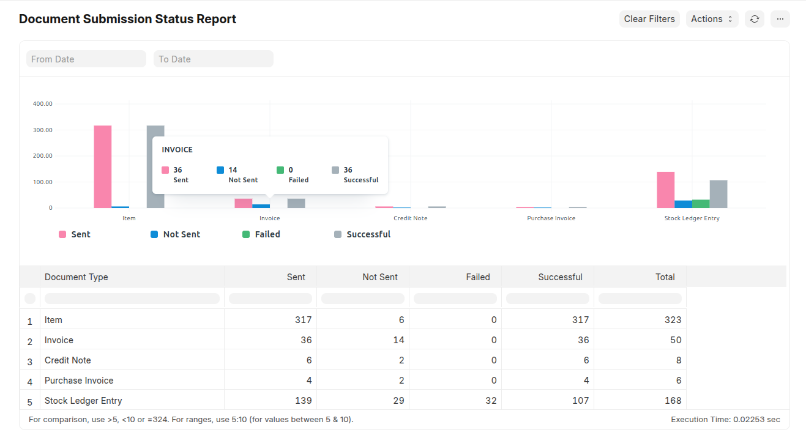
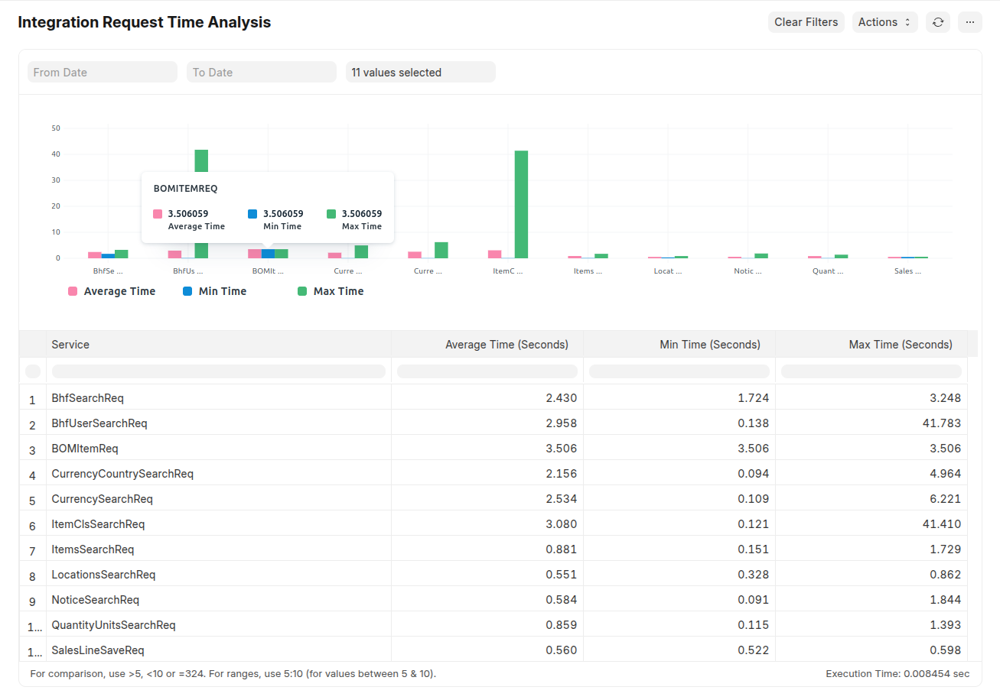
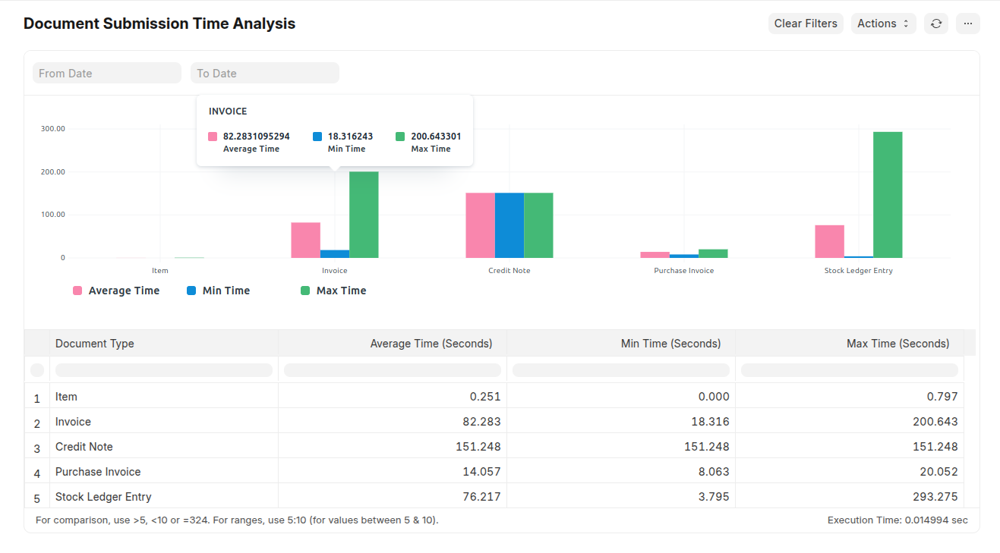
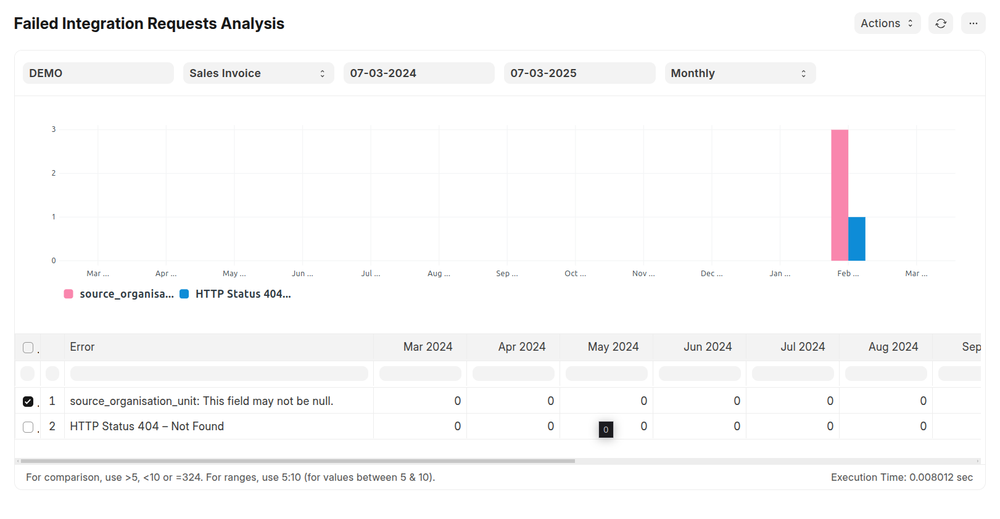
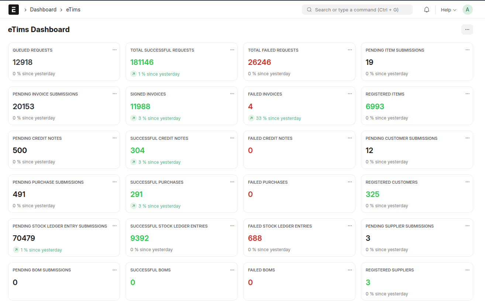
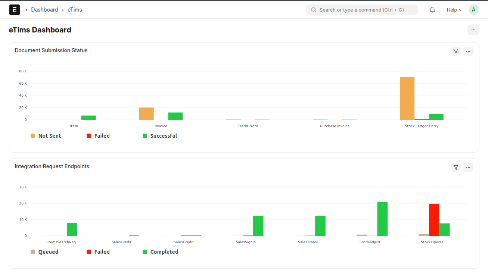
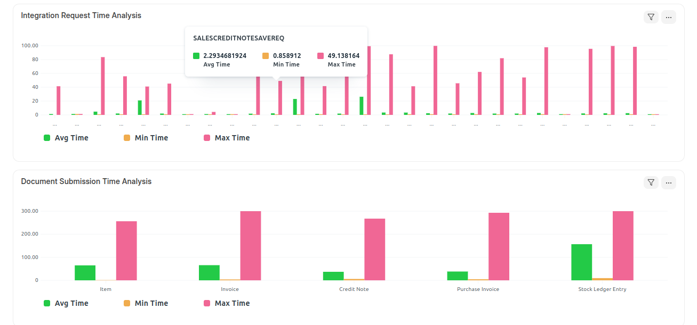

# Dashboard & Reports

This section provides an overview of key reports and dashboards, offering insights into document submissions, request tracking, and real-time eTims integration.

---

## 🔍 **Integration Requests Tracking Report**

The **Integration Requests Tracking Report** tracks all integrations through the Integration Request doctype, providing a detailed report of each API URL by route key. It monitors the different statuses for each request.

### What It Tracks:

- **API Requests** – Logs every submission sent to eTims.
- **Responses** – Tracks eTims responses and statuses.
- **Error Handling** – Identifies failed requests and highlights areas requiring attention.

✅ **Features:**

- Real-time tracking of all eTims communication.
- Detailed request-response logs for auditing.
- Instant identification of failed or incomplete transactions.

---

## 📊 **Document Submission Status Report**

The **Document Submission Status Report** offers a comprehensive view of all critical documents sent to eTims. It helps track submission status and ensures compliance with regulatory requirements.

### Key Documents Tracked:

- **Sales Invoice** – Monitor successful submissions and track any pending or failed invoices.
- **Item** – Ensure items are registered correctly with eTims and validate their compliance.
- **Purchase Invoice** – Keep records of all supplier invoices and ensure they align with eTims regulations.
- **Stock Ledger Entry (SLE)** – Track inventory movements and ensure real-time updates to eTims.

✅ **Features:**

- View submission statuses: Pending, Successful, Failed.
- Detailed logs for each document type.
- Identify errors and correct submission failures.

---

## ⏳ **Integration Request Time Analysis Report**

The **Integration Request Time Analysis Report** provides insights into the efficiency of integration services by measuring the time taken for requests to receive their first status update. This report helps monitor system performance, detect delays, and optimize response times.

### **What It Tracks:**

- **Service Processing Time** – Measures the time from request creation to the first recorded status update.
- **Performance Metrics:**
  - **Average Time (Seconds)** – The mean duration for a request to change status, indicating overall system efficiency.
  - **Min Time (Seconds)** – The fastest recorded status update time, showcasing best-case performance.
  - **Max Time (Seconds)** – The longest recorded processing time (excluding outliers beyond 300 seconds) to highlight potential delays.
- **Filtered Analysis** – Supports filtering by **date range** and **service type** for focused insights.

✅ **Features:**

- Real-time tracking of integration request processing times.
- Helps identify slow-performing services that may need optimization.
- Filters out excessively long processing times (>300s) to prevent skewed data.
- Supports drill-down analysis by service type and date range.

---

## 📊 **Document Submission Time Analytics Report**

The **Document Submission Time Analytics Report** provides a detailed analysis of the time taken for various documents to be submitted. It calculates the **minimum**, **maximum**, and **average** time (in seconds) taken for document submissions, helping you identify bottlenecks and optimize processes.

### Key Documents Tracked:

- **Item** – Tracks the time taken for item submissions.
- **Invoice** – Monitors the submission time for sales invoices.
- **Credit Note** – Tracks the submission time for credit notes.
- **Purchase Invoice** – Monitors the time taken for purchase invoice submissions.
- **Stock Ledger Entry (SLE)** – Tracks the time taken for inventory movement updates.

### ✅ **Features:**

- **Average Time**: Calculates the average time taken for document submissions.
- **Minimum Time**: Identifies the fastest submission time for each document type.
- **Maximum Time**: Highlights the slowest submission time for each document type.
- **Filter by Date Range**: Allows filtering data based on a specific date range.
- **Bar Chart Visualization**: Provides a visual representation of the average, minimum, and maximum submission times.

---

# 📊 **Failed Integration Requests Report**

The **Failed Integration Requests Report** provides a detailed analysis of failed integration requests in your system. It helps identify common errors, track their frequency over time, and take corrective actions to improve integration reliability.

### Key Features:

- **Error Tracking**: Tracks failed integration requests grouped by error messages.
- **Periodic Analysis**: Analyzes errors over customizable time periods (e.g., weekly, monthly, quarterly).
- **Visualization**: Displays error trends in a bar chart for easy interpretation.
- **Custom Filters**: Allows filtering by document type and date range.

---

## 📈 **eTims Dashboard**

The **eTims Dashboard** provides a real-time overview of all eTims-related activities, helping you manage compliance and track submissions efficiently.

### Dashboard Insights:

#### 📌 **Key Metrics & Cards:**

- **Queued Requests** – Displays the number of requests queued for processing.
- **Total Successful Requests** – Shows the total number of successfully processed requests.
- **Total Failed Requests** – Tracks all failed eTims submissions.
- **Pending Item Submissions** – Lists items that are yet to be submitted.
- **Pending Invoice Submissions** – Highlights invoices waiting for submission.
- **Signed Invoices** – Indicates the total number of invoices successfully signed and submitted.
- **Failed Invoices** – Tracks invoices that failed during submission.
- **Registered Items** – Shows the number of successfully registered items in eTims.
- **Pending Credit Notes** – Lists credit notes that are yet to be submitted.
- **Successful Credit Notes** – Displays the number of successfully processed credit notes.
- **Failed Credit Notes** – Tracks credit notes that were not successfully processed.
- **Pending Customer Submissions** – Lists customers that are yet to be submitted.
- **Pending Purchase Submissions** – Highlights purchase submissions waiting for processing.
- **Successful Purchases** – Shows the number of successfully processed purchases.
- **Failed Purchases** – Tracks purchases that failed during submission.
- **Registered Customers** – Displays the number of successfully registered customers.
- **Pending Stock Ledger Entry Submissions** – Lists stock ledger entries that are yet to be submitted.
- **Successful Stock Ledger Entries** – Shows the number of successfully processed stock ledger entries.
- **Failed Stock Ledger Entries** – Tracks stock ledger entries that failed during submission.
- **Pending Supplier Submissions** – Lists suppliers that are yet to be submitted.
- **Pending BOM Submissions** – Highlights BOM submissions waiting for processing.
- **Successful BOMs** – Shows the number of successfully processed BOMs.
- **Failed BOMs** – Tracks BOMs that failed during submission.
- **Registered Suppliers** – Displays the number of successfully registered suppliers.

#### 📊 **Charts & Visual Insights:**

1. **Document Submission Status** – Provides a graphical representation of submission statuses (Pending, Successful, Failed).

2. **Integration Request Endpoints** – Displays a chart summarizing API requests, endpoints, and responses.

3. **Integration Request Time Analysis** – Chart analyzing the time taken for integration requests to complete.

4. **Document Submission Time Analysis** – Chart providing a detailed analysis of the time taken for various document submissions.

✅ **Features:**

- Visual summary of submission statuses.
- Quick access to detailed records and logs.
- Efficient troubleshooting with error reporting.

---

[⬅️ Previous: Customisations](./customisations.md)
