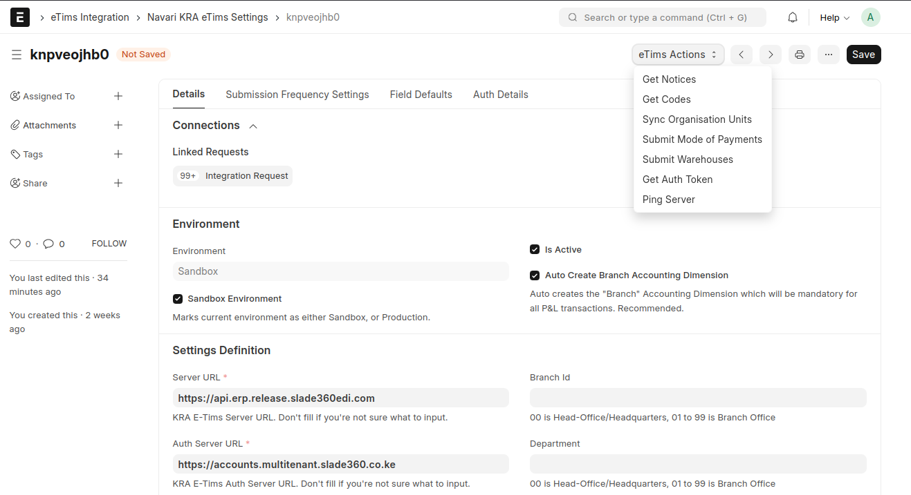
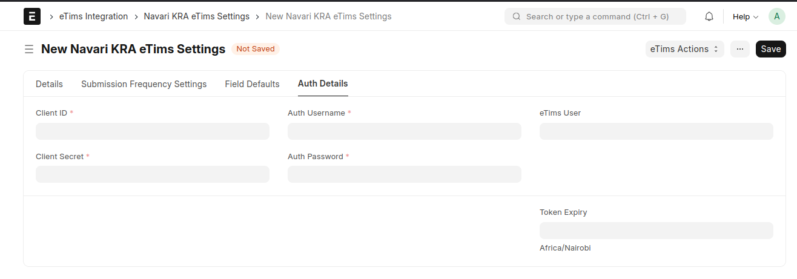
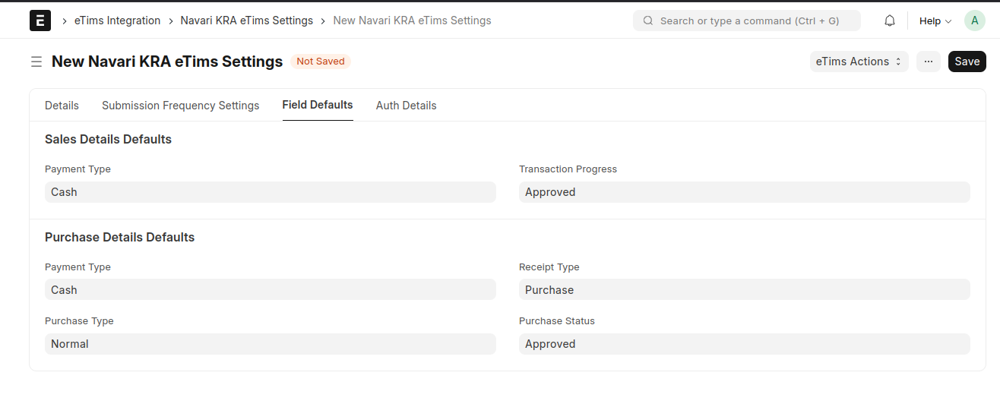
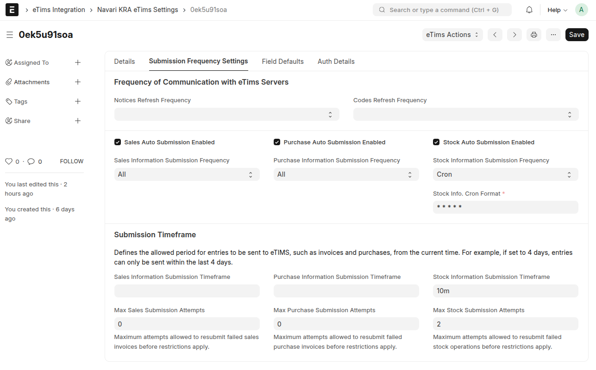

### 🌍 Environment Settings

This doctype aggregates all the settings and credentials required for communication with the eTims Servers.

#### Fields Included:

1. **Branch ID**: Provided by KRA during eTIMS VSCU registration.
2. **Device Serial Number**: Issued by KRA during eTIMS VSCU registration.
3. **Company**: Links to an existing company in the ERPNext instance.
4. **Department**: Maps requests to the Slade Server and ERPNext.
5. **Workstation**: Maps requests to the Slade Server and ERPNext.
6. **Server URL**: Used for all requests to eTIMS.
7. **Auth Server URL**: Used to generate the access token.
8. **Sandbox Environment Check**: Indicates whether the settings are for the Sandbox (testing) or Production (real-world) eTIMS server.
9. **Is Active Check**: Marks the settings record as active. Only one settings record can be active for each unique combination of environment, company (and company PIN), and branch ID.

### 🔐 Authentication Details

The Authentication Details tab includes fields for storing client secrets, keys, username, password, and token details. These fields are essential for secure communication with the eTims servers.

1. **Client Secret**: The secret key provided by Slade360.
2. **Client Key**: The client key issued by Slade360.
3. **Username**: The username for authentication.
4. **Password**: The password for authentication.
5. **Token**: The access token used for subsequent communication.

> **NOTE**: If the token expires, it will be automatically regenerated upon a new eTims request.

### 🧾 Sales and Purchase Invoice Defaults

The Sales and Purchase Invoice Defaults tab allows users to set default values for sales and purchase invoices, ensuring consistency and reducing the need for manual entry.

1. **Payment Type**: The default payment type for sales invoices.
2. **Transaction Progress**: The default transaction progress for sales invoices.
3. **Purchase Type**: The default purchase type for purchase invoices.
4. **Purchase Status**: The default status for purchase invoices.
5. **Receipt Type**: The default receipt type for purchase invoices.

> **NOTE**: These defaults can be overridden on individual invoices if necessary.

### 🔄 Frequency of Communication with eTims Servers

This section defines how often different types of information are refreshed or submitted to eTims.

1. **Notices Refresh Frequency**: Frequency at which system notices are refreshed.
2. **Codes Refresh Frequency**: Frequency for refreshing system codes.
3. **Sales Auto Submission Enabled**: Enables or disables automatic submission of sales data.
4. **Sales Information Submission Frequency**: Defines how often sales data is sent.
5. **Purchase Auto Submission Enabled**: Enables or disables automatic submission of purchase data.
6. **Purchase Information Submission Frequency**: Defines how often purchase data is sent.
7. **Stock Auto Submission Enabled**: Enables or disables automatic submission of stock data.
8. **Stock Information Submission Frequency**: Defines how often stock data is sent.
9. **Stock Info. Cron Format**: Defines the cron format for stock information submission.
10. **Submission Timeframe**: Sets the allowed period for sending entries such as invoices and purchases to eTIMS.
    - **Sales Information Submission Timeframe**: Maximum period allowed for submitting sales information.
    - **Max Sales Submission Attempts**: Maximum retries for failed sales invoice submissions before restrictions apply.
    - **Purchase Information Submission Timeframe**: Maximum period allowed for submitting purchase information.
    - **Max Purchase Submission Attempts**: Maximum retries for failed purchase invoice submissions before restrictions apply.
    - **Stock Information Submission Timeframe**: Maximum period allowed for submitting stock information.
    - **Max Stock Submission Attempts**: Maximum retries for failed stock submissions before restrictions apply.
