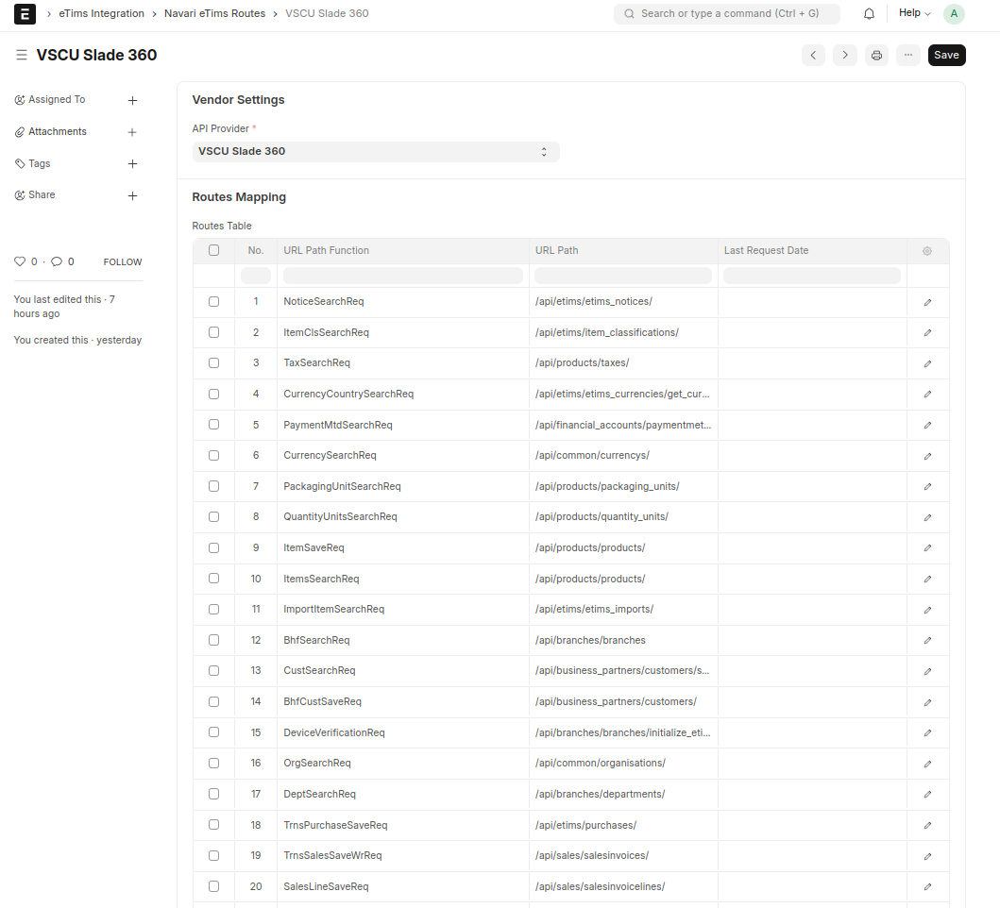

# 🚀 Navari eTims API Routes

## 📌 Overview

This document provides a comprehensive reference for the available API routes. These routes enable seamless integration with Slade360 for various functionalities such as retrieving notices, handling products, managing financial accounts, and processing transactions.

## 🚦 Routes Reference

### 📜 Notices & Classifications

| Endpoint                           | Function           | Description                   |
| ---------------------------------- | ------------------ | ----------------------------- |
| `/api/etims/etims_notices/`        | `NoticeSearchReq`  | Fetch eTims notices           |
| `/api/etims/item_classifications/` | `ItemClsSearchReq` | Retrieve item classifications |

### 💰 Tax & Currency Management

| Endpoint                                     | Function                   | Description                    |
| -------------------------------------------- | -------------------------- | ------------------------------ |
| `/api/products/taxes/`                       | `TaxSearchReq`             | Retrieve tax details           |
| `/api/etims/etims_currencies/get_currencies` | `CurrencyCountrySearchReq` | Get available currencies       |
| `/api/common/currencys/`                     | `CurrencySearchReq`        | Search for a specific currency |

### 💳 Payment & Financial Accounts

| Endpoint                                  | Function              | Description                        |
| ----------------------------------------- | --------------------- | ---------------------------------- |
| `/api/financial_accounts/paymentmethods/` | `PaymentMtdSearchReq` | Retrieve available payment methods |

### 📦 Products & Packaging

| Endpoint                         | Function                 | Description                     |
| -------------------------------- | ------------------------ | ------------------------------- |
| `/api/products/packaging_units/` | `PackagingUnitSearchReq` | Retrieve packaging unit details |
| `/api/products/quantity_units/`  | `QuantityUnitsSearchReq` | Fetch quantity units            |
| `/api/products/products/`        | `ItemSaveReq`            | Save a product item             |
| `/api/products/products/`        | `ItemsSearchReq`         | Search for products             |

### 🚢 Import Management

| Endpoint                    | Function              | Description           |
| --------------------------- | --------------------- | --------------------- |
| `/api/etims/etims_imports/` | `ImportItemSearchReq` | Search imported items |

### 🏢 Business & Branch Management

| Endpoint                                                   | Function                | Description                    |
| ---------------------------------------------------------- | ----------------------- | ------------------------------ |
| `/api/branches/branches`                                   | `BhfSearchReq`          | Retrieve branch details        |
| `/api/business_partners/customers/search_customer_on_kra/` | `CustSearchReq`         | Search for customers on KRA    |
| `/api/business_partners/customers/`                        | `BhfCustSaveReq`        | Save business customer details |
| `/api/branches/branches/initialize_etims_device/`          | `DeviceVerificationReq` | Initialize an eTims device     |
| `/api/common/organisations/`                               | `OrgSearchReq`          | Search for organizations       |
| `/api/branches/departments/`                               | `DeptSearchReq`         | Retrieve department details    |

### 🛒 Transactions: Purchases & Sales

| Endpoint                                                                 | Function               | Description                         |
| ------------------------------------------------------------------------ | ---------------------- | ----------------------------------- |
| `/api/etims/purchases/`                                                  | `TrnsPurchaseSaveReq`  | Save purchase transactions          |
| `/api/sales/salesinvoices/`                                              | `TrnsSalesSaveWrReq`   | Save sales invoices                 |
| `/api/sales/salesinvoicelines/`                                          | `SalesLineSaveReq`     | Save sales invoice lines            |
| `/api/sales/salesinvoices/{invoice_id}/transition/DRAFT_SUBMIT_APPROVE/` | `SalesTransitionReq`   | Approve a draft sales invoice       |
| `/api/sales/salesinvoices/{invoice_id}/sign_sales_invoice/`              | `SalesSignInvReq`      | Sign a sales invoice                |
| `/api/etims/purchases/`                                                  | `TrnsPurchaseSalesReq` | Process purchase sales transactions |
| `/api/etims/purchasesitems/`                                             | `TrnsPurchaseItemReq`  | Manage purchase items               |

### 👤 User Management

| Endpoint           | Function         | Description  |
| ------------------ | ---------------- | ------------ |
| `/api/auth/users/` | `BhfUserSaveReq` | Manage users |

---

### 📖 Additional Documentation

For more details on how to use these endpoints and integrate them into your system, refer to the official **eTims API Documentation**.

For further information on Slade360, visit the [Slade360 Documentation](https://developers.slade360.com/reference/).

---

### 🎯 Notes

- The **URL Path Function** field is used for searching endpoints.
- Endpoints return **JSON responses** with relevant data.

💡 _Stay up to date with new API releases and updates!_
