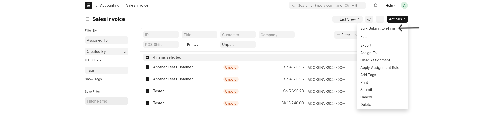
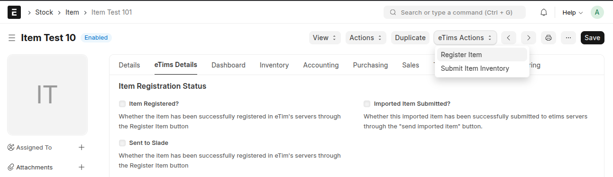
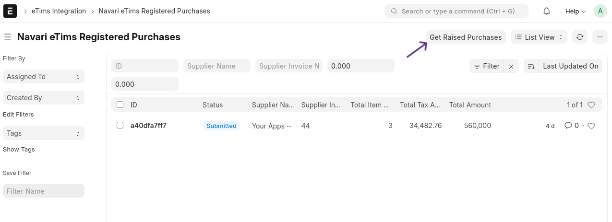

## 🚀 Key Features

Explore the key features of our application:

1. [Application Workspace](#workspace)
2. [Error Logs & Integration Requests](#error_logs_integration_requests)
3. [Bulk Submission of Information](#bulk_submissions)
4. [Flexible Setup and Configuration](#flexible_setup_and_configuration)
5. [Item Registration](#item_registration)
6. [Supplier and Customer Management](#supplier_customer_management)
7. [Invoice Submission (Sales and Purchases)](#invoice_submission)
8. [Stock Submission](#stock_submission)
9. [BOM Submission](#bom_submission)
10. [Registered Purchases](#registered_purchases)
11. [Imports Fetch](#imports_fetch)

### 🖥️ Application Workspace

The workspace contains shortcuts to various documents of interest concerning eTims.

> **Note**: The workspace may look different depending on when you install the app or due to future changes.

### 🛠️ Error Logs & Integration Requests

Each request is logged in the Integration Request DocType. Any response errors are logged in the Error Log DocType. Additionally, logs are written and can also be accessed through the logs folder of the bench harbouring the running instance if the records in the Error Logs/Integration Request DocTypes are cleared.

### 📊 Bulk Submission of Information

Bulk submission of information is supported for relevant DocTypes. This feature allows users to submit multiple records at once, streamlining the data entry process and ensuring consistency across the system.

### 📦 Item Registration

Items are sent automatically upon creation or update if the relevant settings are enabled. Additionally, there are options to send items using the submit button under eTims actions, as well as through bulk submission. Current stock balances are also sent on registration. Items have to be classified to several eTims codes and classifications. More detailed information on [Item Registration](./features/item_registration.md#item-registration).

### 👥 Supplier and Customer Management

Suppliers and customers are also sent manually, in bulk, or automatically on update or creation. More detailed information on [Supplier and Customer Management](./features/supplier_customer_management.md#customer-and-supplier-registration).

### 🧾 Invoice Submission (Sales and Purchases)

Invoice Submission simplifies the process of submitting sales and purchase invoices, ensuring compliance. Invoices are submitted upon finalization, either individually, in bulk, or through a background job based on the configuration in the settings. Credit notes are also handled in this process. Additionally, SCU Data, including QR Codes for Sales Invoices, is generated here. More detailed information on [Invoice Submission](./features/invoice_submission.md).

### 📈 Stock Submission

All operations affecting stock, such as Stock Entries, Sales Invoices, etc., are tracked using Stock Ledger Entries (SLE) and submitted to eTims. This process uses a background job, with frequency and other configurations set in the settings document, ensuring real-time inventory tracking. More detailed information on [Stock Submission](./features/stock_submission.md).

### 📝 BOM Submission

BOMs are submitted after they are submitted or through manual submission.

### 🛒 Registered Purchases

The Registered Purchases feature allows users to fetch all purchases from eTims and generate related invoices in ERPNext with the associated suppliers and items. More detailed information on [Registered Purchases](./features/registered_purchases.md).

### 🌐 Imports Fetch

The Imports Fetch feature enables users to fetch and manage imported goods data from eTims. This includes mapping the imported items. More detailed information on [Imports Fetch](./features/imports_fetch.md).

[⬅️ Previous: Setup Configuration](./setup_configuration.md) | [Next: Key Doctypes ➡️](./doctypes.md)
