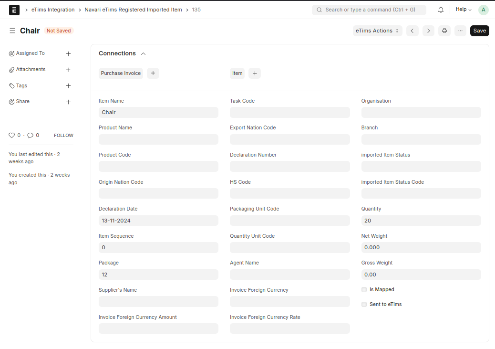
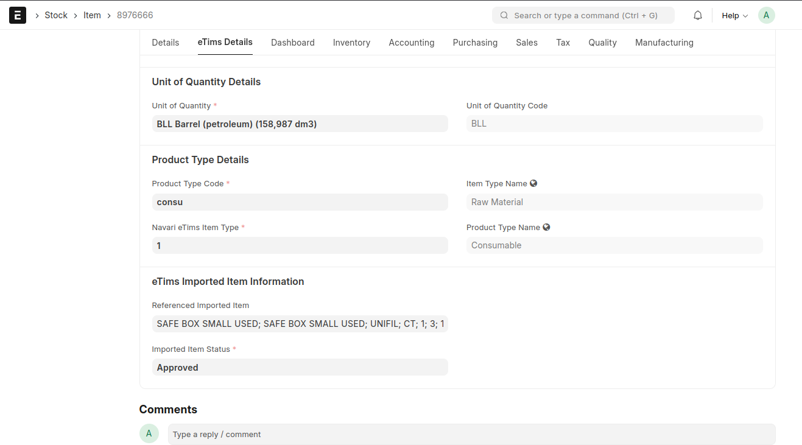

### 📦 Imported Item Management

The **Registered Imported Item** doctype allows you to fetch imported items declared to belong to your company. These items can be either existing items (already in ERPNext's database) or new items.

To link an imported item to an existing item, reference the item in the _Referenced Imported Item_ field of the Item doctype under the _Purchasing_ tab.

Once the records are linked, you can submit the _converted_ item (specifying the item classification of the accepted imported item) back to eTims to register the item. This is done through the _eTims Action, Submit Imported Item_ action button. This button is active if the item is linked to an imported item and has not been registered previously.
