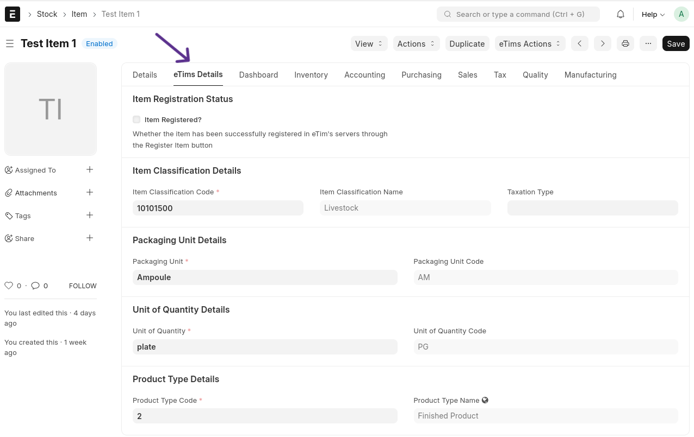
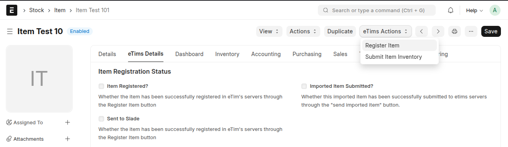
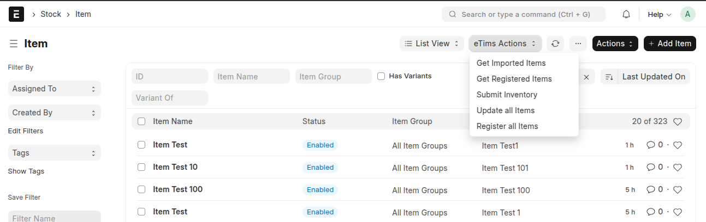

## 🛠️ Item Customisations

### 📋 eTims Details Tab

The **eTims Details tab** will be present for each item during and after loading. This tab contains fields for various doctypes that allow classification of each item according to the specifications provided by KRA.

> **NOTE**: The information captured here is mandatory when sending sales information to the eTims servers.

#### 📦 Sent to Slade

**custom_sent_to_slade**: Indicates whether the item has been successfully sent to Slade 360's servers through the Register Item button.

#### 🚫 Prevent eTIMS Registration

**custom_prevent_etims_registration**: Enable this option to exclude the item from being sent to eTIMS. When checked, this item will not be registered or used in eTIMS transactions.

#### 📤 Imported Item Submitted?

**custom_imported_item_submitted**: Indicates whether this imported item has been successfully submitted to eTIMS servers through the "send imported item" button.

#### 🆔 Slade ID

**custom_slade_id**: The unique identifier assigned to the item by Slade 360's servers.

#### 🔄 Submission Tries

Tracks the number of attempts made to submit the item to the respective servers.

#### 🔗 Linked Doctypes

1. **Item Classifications**: Item classifications as specified by KRA.
2. **Packaging Unit**: Packaging units as specified by KRA, e.g., jars, wooden boxes, etc.
3. **Unit of Quantity**: Units of quantity as specified by KRA, e.g., kilogrammes, grammes, etc.
4. **Product Type**: Product type as specified by KRA, e.g., finished product, raw materials, etc.
5. **Item Type**: Product type as specified by KRA, e.g., SKU, consumable, service, etc.
6. **Country of Origin**: The country of origin declared for the item.

### 📝 Item Registration

Items are submitted on update or creation if the relevant settings are enabled and all required fields are filled. Additionally, items can be sent using the _Register Item_ button under eTims actions.

#### 🔄 Registration Process

1. **On Registration**:
   - Creates an `ItemSaveReq` integration request.
   - Receives the Slade ID.
2. **Bulk Submission**:
   - Queues the item registration through _Bulk Register Items_ or _Submit All Items_.
3. **After Submitting an Item**:
   - Inventory is submitted using an `Inventory Adjustment Request - StockMasterSaveReq`.
   - Options to _Submit All Inventory_ in the item list and _Submit Inventory_ under eTims actions for each item.
