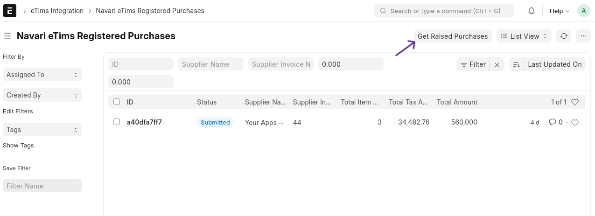
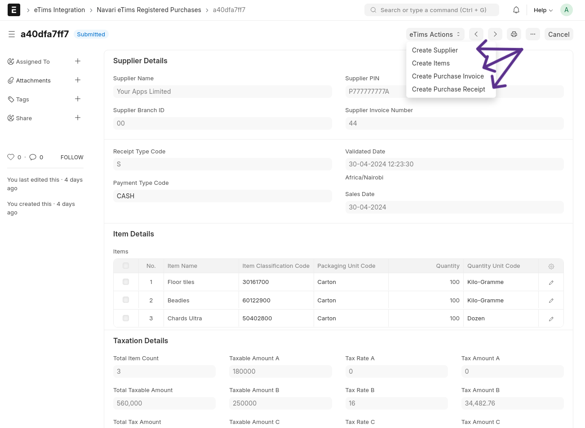

### Fetching Purchases

Users can fetch sales details registered by other parties, which form the basis for purchase documents.

Once the counter-party's sales information (your purchase) is successfully fetched, you can create items, suppliers, purchase invoices, and purchase receipts from the details.

> **Note:** ⚠️ This feature is highly experimental and may result in discrepancies between the information fetched and the generated records, such as tax details after creating a purchase invoice.
