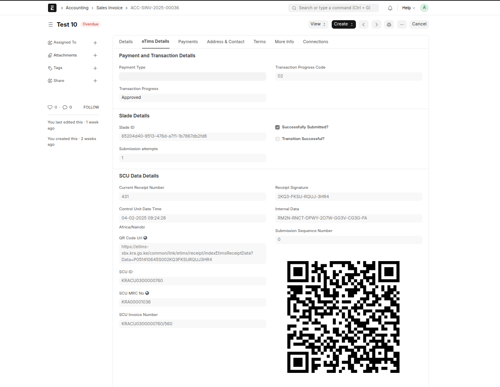
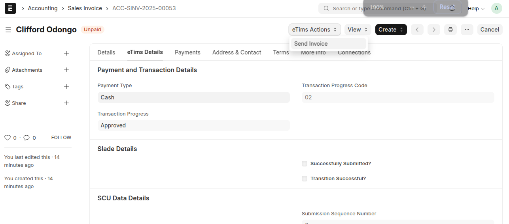
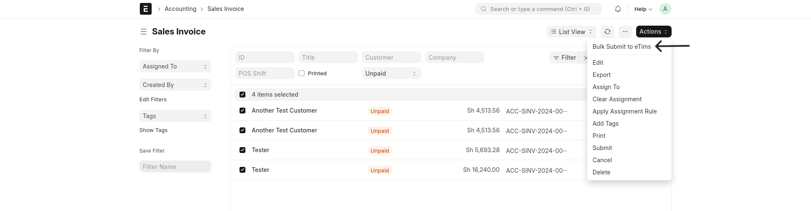

## 🧾 Sales Invoice Customisation

Invoice Submission simplifies the process of submitting sales invoices, ensuring compliance. Invoices can be submitted upon finalization, either individually, in bulk, or through a background job based on the configuration in the settings. Additionally, SCU Data, including QR Codes for Sales Invoices, is generated here.

### 🔧 Customizations

The **eTims Details** tab includes fields for additional details required to submit invoices and save the eTims response.

#### 📋 Added Sections

- **Payment and Transaction Details**: Fields related to payment and transaction details.
- **Slade Details**: Captures response data from submission requests.
- **SCU Data Details**: Stores secure codes and QR data from eTims.
- **eTims Tax Response Details**: Stores tax-related response data from eTims.

### 🚀 Invoice Submission Process

Invoices are submitted through different mechanisms based on configuration:

1. **Auto Submission**:

   - Automatically submits invoices upon finalization.

2. **Bulk Submission**:

   - Allows submitting multiple invoices at once via the _Bulk Submit Invoices_ or _Submit All Invoices_ option.

3. **Scheduled Background Job**:
   - Submits invoices automatically at predefined intervals based on settings.

## 🔄 Submission Flow & API Requests

The invoice submission follows a structured sequence of API requests:

1. **TrnsSalesSaveWrReq** → Saves invoice details.
2. **SalesLineSaveReq** → Sent for each item line in the invoice.
3. **SalesTransitionReq** → Processes the invoice after all item lines are submitted.
4. **SalesSignInvReq** → Sends the finalized invoice to eTims for validation and submission.

## 🔐 SCU Data & Compliance

Once the invoice is processed, SCU data (Secure Control Unit) is retrieved and stored, including:

- **QR Code**
- **Current Receipt Number**
- **Control Unit Date Time**
- **QR Code URL**
- **SCU ID**
- **SCU MRC No**
- **SCU Invoice Number**
- **Receipt Signature**
- **Internal Data**
- **Submission Sequence Number**
