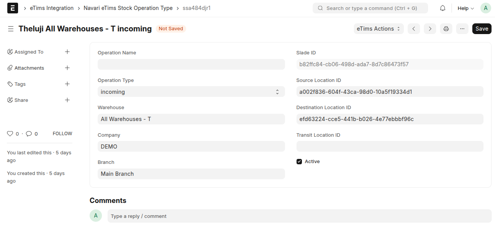

# **📦 Stock Submission**

## 🚧 Warehouse Customizations

## 🔄 Operation Type

## **📋 Process Overview**

Stock-related transactions such as Stock Entries and Sales Invoices are tracked through **Stock Ledger Entries (SLE)** and submitted to **eTims** for compliance and reporting. This process is automated using a background job, with frequency and settings configurable in the **eTims Settings**.

Stock submissions are categorized into two primary processes: **Stock Adjustment** and **Stock Operations**. Each process follows a specific request flow to ensure accurate tracking, validation, and submission to **eTims**.

---

## **📑 Types of Requests**

### **1️⃣ Stock Adjustment**

Stock Adjustments handle inventory changes due to **Opening Stock** and **Stock Reconciliation** in ERPNext.

#### **Doctypes/Scenarios for Adjustment**

- **Opening Stock** → Initial stock setup for new items and opening stock Stock Entry.
- **Stock Reconciliation Doctype**

#### **Mapping to Locations**

- **Location** → Uses the **default warehouse** set in the system settings.

---

### **2️⃣ Stock Operation**

#### **Stock Operation Types & Mapping**

| **ERPNext Doctype**                                                     | **Operation Type**    | **Description**                                                 |
| ----------------------------------------------------------------------- | --------------------- | --------------------------------------------------------------- |
| **Purchase Receipt / Purchase Invoice (update stock)**                  | **Incoming**          | Stock received from supplier, incl. taxes.                      |
| **Stock Entry (Material Receipt)**                                      | **Incoming**          | Stock received directly into inventory.                         |
| **Stock Entry (Manufacture – Finished Product)**                        | **Outgoing/Incoming** | Outgoing = finished product, Incoming = raw materials consumed. |
| **Stock Entry (Repack – Finished Product)**                             | **Outgoing/Incoming** | Outgoing = raw materials, Incoming = finished product.          |
| **Stock Entry (Transfer – Incoming)**                                   | **Incoming**          | Positive stock movement during warehouse transfer.              |
| **Sales Return (Cancelled Delivery Note) / Credit Note (update stock)** | **Incoming**          | Stock returned by customers, incl. taxes.                       |
| **Delivery Note / Sales Invoice (update stock)**                        | **Outgoing**          | Stock delivered to customers, incl. taxes.                      |
| **Stock Entry (Material Issue)**                                        | **Outgoing**          | Stock issued for internal use or projects.                      |
| **Stock Entry (Transfer – Outgoing)**                                   | **Outgoing**          | Negative stock movement during warehouse transfer.              |
| **Purchase Return / Debit Note (update stock)**                         | **Outgoing**          | Returned stock to suppliers, incl. taxes.                       |
| **Stock Entry (Repack – Raw Materials)**                                | **Outgoing**          | Raw materials used for repacking.                               |
| **Stock Entry (Manufacture – Raw Materials)**                           | **Outgoing**          | Raw materials consumed in manufacturing.                        |
| **Stock Entry (Send to Subcontractor)**                                 | **Outgoing**          | Stock sent to subcontractor for processing.                     |
| **Asset Repair (Stock Consumed During Repair)**                         | **Outgoing**          | Materials used in asset repair.                                 |

---

#### **Mapping Logic for ERPNext & Slade Locations**

1. **Incoming Transactions**

   - Source → **Supplier (Slade)**
   - Destination → **Default warehouse (from eTims settings)**

2. **Outgoing Transactions**
   - Source → **Default warehouse (from eTims settings)**
   - Destination → **Customer (Slade)**

## **🔄 Stock Operation Submission Process**

1. **Create Operation**

   - Use `StockIOSaveReq` for inventory operations.
   - Use `StockMasterSaveReq` for inventory adjustments.

2. **Operation Line**

   - Use `StockIOLineReq` for inventory operations.
   - Use `StockMasterLineReq` for inventory adjustments.

3. **Process Request**

   - Use `StockOperationTransitionReq` for inventory operations.
   - Use `StockAdjustmentTransitionReq` for inventory adjustments.
